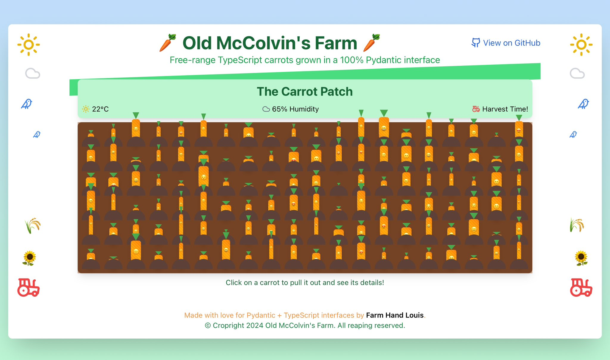

# pyd2ts-demo

[](https://pyd2ts-demo.vercel.app/)
[](https://github.com/lmmx/pyd2ts-demo)

This project demos a simple yet seamlessly exposed interface 'syncing' Pydantic models as TypeScript interface declaration.
This showcases a powerful approach for full-stack Python and TypeScript development,
which can potentially cut down on rework and communication friction between teams in differing
languages: united by a common JSON schema!

## The Python side

The Python side is a super simple Pydantic model interface

- `interface.py` defines a model (Python class) `Carrot`, with sub-models `Location` and `Conditions`.
- When called, the module writes the JSONSchema for the `Carrot` model to `schema.json`
- This is converted to TypeScript `model.d.ts` declaration with Node.JS by the following one-liner:

```sh
npx json-schema-to-typescript schema.json -o model.d.ts
```

> **Side note:** there are no Python libraries to convert JSON Schema to TypeScript(!)

## React demo app

To demonstrate the practical application of this approach,
I've created a simple React app that uses the generated TypeScript interface.

You can get started with your own in a similar manner like this:

```sh
npx create-react-app carrot-demo --template typescript
cp model.d.ts carrot-demo/interface.d.ts
```

The app visualises a carrot patch based on the `Carrot` model.



This was the first TypeScript project I ever wrote! :-)

## Why This Matters

1. **Type Safety Across Stacks**: By converting Pydantic models to TypeScript interfaces,
   ensures type consistency between backend (Python) and frontend (TypeScript/JavaScript) codebases.

2. **Improved Developer Experience**: Automatically generated TypeScript interfaces reduce manual rework
   and potential errors in maintaining parallel type definitions "in sync".

3. **Better Documentation**: The resulting TypeScript interfaces serve as living documentation of your data structures,
   improving code readability and maintainability.

4. **Streamlined API Integration**: This approach facilitates smoother API integrations,
   as frontend developers can work with strongly-typed data structures that mirror the backend models.

## How It Works

1. Define a Pydantic model in Python (`Carrot` in this case).
2. Generate a JSON Schema from the Pydantic model.
3. Convert the JSON Schema to a TypeScript interface declaration.

```sh
# Generate TypeScript interface from JSON Schema
npx json-schema-to-typescript schema.json -o model.d.ts
```

> **Note:** Currently, there are no Python libraries that directly convert JSON Schema to TypeScript, making this Node.js step necessary.

## Testing Type Conformity

Ensuring that the generated TypeScript interfaces accurately represent the original Pydantic models
is crucial for maintaining type safety across the stack here.

One simple approach to verify this conformity would be round trip testing:

1. **Generate Test Data**: Use the Pydantic model to generate a set of valid test data in JSON format.
2. **Runtime Type Checking**: Implement runtime type checking in TypeScript/JavaScript to validate
   the generated test data against the TypeScript interface.

### Implementation

We can use TypeScript's built-in type system combined with a runtime type checking library like
`io-ts` or `zod`. Here's a basic example using `zod`:

1. Install necessary dependencies:
   ```sh
   npm install zod jest ts-jest @types/jest
   ```

2. Create a test file (e.g., `carrot.test.ts`):
   ```typescript
   import { z } from 'zod';
   import { Carrot } from './interface'; // Your generated TypeScript interface
   import testData from './test_data.json'; // JSON data generated from Pydantic

   const CarrotSchema = z.object({
     length_cm: z.number(),
     diameter_cm: z.number(),
     age_months: z.number(),
     location: z.object({
       lat: z.number(),
       long: z.number(),
     }),
     conditions: z.object({
       temperature_degC: z.number(),
       humidity_pct: z.number(),
     }),
   });

   describe('Carrot Interface Validation', () => {
     it('should validate test data against the TypeScript interface', () => {
       testData.forEach((carrot: Carrot) => {
         expect(() => CarrotSchema.parse(carrot)).not.toThrow();
       });
     });
   });
   ```

3. Run the tests:
   ```sh
   npx jest
   ```

This approach allows you to verify that the data structures generated by your Pydantic model conform
to the TypeScript interface, providing an additional layer of confidence in the type conversion process.

### Continuous Integration

To ensure ongoing conformity (i.e. "staying in sync"), you'd want to integrate these tests into a CI/CD pipeline.
This will catch any discrepancies that might arise from changes in either the Pydantic model or the TypeScript interface
generation process.

### Limitations and Considerations

- While this method provides strong assurances, it's not a formal proof of equivalence between the
  Pydantic model and TypeScript interface.
- Edge cases or complex type relationships might require additional, more specific tests.
- Regular review and updates to the test suite are recommended as your data models evolve.

Implementing these tests would be required for real world confidence in the accuracy of these type definitions
across a Python backend and TypeScript frontend, but that reliability is highly desirable for full-stack type safety.

## Getting Started

1. Clone this repository
2. Follow the README in the `carrot-demo` directory to set up and run the React app
3. Explore the code to see how Pydantic models are transformed into TypeScript interfaces and used in a React application

## Live Demo

Check out the live demo of the React app: [Old McColvin's Farm](https://pyd2ts-demo.vercel.app/)
